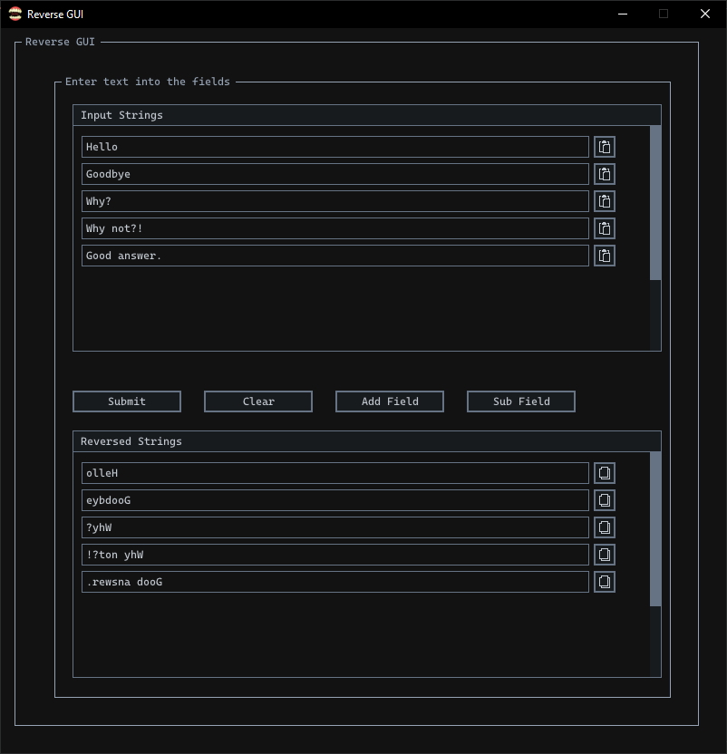

About
-----
**A silly tool for reversing strings.**

- Made with Raylib and Raygui by Ramon Santamaria (@raysan5).
- With SDL as a backend (@libsdl-org).
- The die() function in the CLI reverse is courtesy of Zed A. Shaw (@zedshaw).

## !! **EXPERIMENTAL:** Use at your own risk !!

Current Progress
-----------------  


TODO
-----
- implement copy/paste

LIBRARY CHANGES
---------------
Getting dark window decorations on Win 10\
is easiest with SDL as a backend.

Options for STATIC and SHARED linking\
with SDL3 are outlined below.

Changes had to be made to Raylib in order to\
statically link SDL3.

## STATIC linking SDL3:

- ./raylib55:
```
Rename every instance of MatrixIdentity and MatrixMultiply
in rcore.c, rmodels.c, raymath.h and rcamera.h.
I chose "rm" as a prefix because these functions have to do
with raymath.

examples from raymath.h:
RMAPI Matrix rmMatrixIdentity(void)
RMAPI Matrix rmMatrixMultiply(Matrix left, Matrix right)
```

- ./raylib55/platforms/rcore_desktop_sdl.c:

```c
// around line 2015
SDL_StartTextInput(platform.window);
```
Directly after window initialization\
and error checking:
```c
// around line 1981

// Init OpenGL context
platform.glContext = SDL_GL_CreateContext(platform.window);
// Check window and glContext have been initialized successfully
if ((platform.window != NULL) && (platform.glContext != NULL))
{
       CORE.Window.ready = true;
       SDL_DisplayMode displayMode = { 0 };
       SDL_GetCurrentDisplayMode(GetCurrentMonitor(), &displayMode);
       CORE.Window.display.width = displayMode.w;
       CORE.Window.display.height = displayMode.h;
       CORE.Window.render.width = CORE.Window.screen.width;
       CORE.Window.render.height = CORE.Window.screen.height;
       CORE.Window.currentFbo.width = CORE.Window.render.width;
       CORE.Window.currentFbo.height = CORE.Window.render.height;
       TRACELOG(LOG_INFO, "DISPLAY: Device initialized successfully");
       TRACELOG(LOG_INFO, "    > Display size: %i x %i", CORE.Window.display.width, CORE.Window.display.height);
       TRACELOG(LOG_INFO, "    > Screen size:  %i x %i", CORE.Window.screen.width, CORE.Window.screen.height);
       TRACELOG(LOG_INFO, "    > Render size:  %i x %i", CORE.Window.render.width, CORE.Window.render.height);
       TRACELOG(LOG_INFO, "    > Viewport offsets: %i, %i", CORE.Window.renderOffset.x, CORE.Window.renderOffset.y);
       if (CORE.Window.flags & FLAG_VSYNC_HINT) SDL_GL_SetSwapInterval(1);
       else SDL_GL_SetSwapInterval(0);
}
else
{
       TRACELOG(LOG_FATAL, "PLATFORM: Failed to initialize graphics device");
       return -1;
}

// this now needs to be called
// in order to handle regular characters
SDL_StartTextInput(platform.window);
```

- ./raylib55/cmake/LibraryConfigurations.cmake:
```cmake
// around line 103
elseif ("${PLATFORM}" MATCHES "SDL")
    #find_package(SDL2 REQUIRED)
    set(PLATFORM_CPP "PLATFORM_DESKTOP_SDL")
    #set(LIBS_PRIVATE SDL2::SDL2)
    set(LIBS_PRIVATE SDL3::SDL3)
```
## SHARED linking SDL3:

Of course, if you don't want to statically link libs;\
Then you can change the appropriate variables in CMakesLists.txt:
```cmake
# SDL3 Options
set(SDL_STATIC OFF)
set(SDL_SHARED ON)

# Raylib Options
set(BUILD_SHARED_LIBS ON)
```

Shared linking still requires one change\
if you want full keyboard support.
- ./raylib55/platforms/rcore_desktop_sdl.c:
```c
// around line 2015
SDL_StartTextInput(platform.window);
```
Directly after window initialization\
and error checking as outlined above\
in the STATIC linking section.

BUILDING
--------
Building should be as simple as using two cmake commands:
```shell
cmake -B build
cmake --build build
```

If you don't want the terminal output running in the background,\
then simply use a Release build:
```shell
cmake -B build -DCMAKE_BUILD_TYPE=Release
cmake --build build
```
\
LICENSE
-------
- Raylib is released under zlib license.
- SDL is released under zlib license.
- learn-c-the-hard-way-lectures are released under MIT license.

```
My personal code for this project is public domain (not that it'll be useful anyways).
No fees
No limitations
No warranties
No attribution necessary 
```
